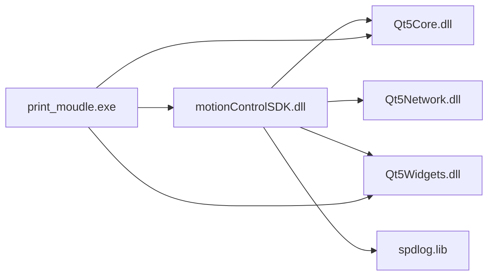

# 打印设备运动控制系统 - 项目技术文档

**版本**: 0.0.1  
**创建日期**: 2026-01-20  
**文档类型**: 技术架构与开发指南

---

## 目录

1. [项目概述](#1-项目概述)
2. [技术架构](#2-技术架构)
3. [项目结构](#3-项目结构)
4. [核心模块详解](#4-核心模块详解)
5. [通信协议](#5-通信协议)
6. [构建与部署](#6-构建与部署)
7. [开发指南](#7-开发指南)
8. [API参考](#8-api参考)
9. [配置说明](#9-配置说明)
10. [常见问题](#10-常见问题)

---

## 1. 项目概述

### 1.1 项目简介

**print_soft_0_0_1** 是一个基于 Qt 5 和 Visual Studio 2017 开发的工业级打印设备运动控制系统。该系统采用**客户端-SDK**分离架构，提供了一套完整的3轴（XYZ）精密运动控制解决方案，适用于工业打印、3D打印、雕刻等需要精确运动控制的应用场景。

### 1.2 项目特点

- ✅ **模块化设计**: SDK 与应用程序解耦，便于集成和维护
- ✅ **高精度控制**: 支持微米级（μm）精度的运动控制
- ✅ **多轴协同**: 支持单轴、多轴同步/异步运动
- ✅ **完善的日志**: 集成 spdlog，支持 Qt 类型格式化输出
- ✅ **TCP 通信**: 基于自定义协议的可靠 TCP 通信
- ✅ **实时监控**: 提供丰富的信号机制，实时反馈设备状态
- ✅ **配置驱动**: 通过 INI 文件灵活配置运动参数

### 1.3 应用场景

- 工业喷墨打印机控制
- 3D 打印设备运动系统
- 激光雕刻/切割设备
- 自动化检测设备
- 精密装配机器人

### 1.4 技术栈

| 类别 | 技术 |
|------|------|
| **开发语言** | C++14 |
| **GUI 框架** | Qt 5.9+ (Qt Widgets) |
| **开发环境** | Visual Studio 2017 (v141) |
| **构建工具** | MSBuild + Qt Visual Studio Tools |
| **日志库** | spdlog 1.x |
| **通信协议** | 自定义二进制协议 (TCP) |
| **序列化** | QDataStream (Little-Endian) |
| **平台** | Windows x64 |

---

## 2. 技术架构

### 2.1 系统架构图

```
┌─────────────────────────────────────────────────────────────┐
│                    UI Application Layer                     │
│  ┌──────────────────┐      ┌──────────────────┐            │
│  │ printDeviceMoudle│◄────►│  PrintDeviceUI   │            │
│  │   (主窗口管理)    │      │   (用户界面)      │            │
│  └────────┬─────────┘      └──────────────────┘            │
└───────────┼──────────────────────────────────────────────────┘
            │ Qt Signals/Slots
┌───────────▼──────────────────────────────────────────────────┐
│              Motion Control SDK (动态链接库)                  │
│  ┌──────────────────────────────────────────────────────┐   │
│  │           motionControlSDK (公共API层)                │   │
│  │  - MC_Init/Release         - MC_Connect2Dev          │   │
│  │  - MC_moveXAxis/Y/Z        - MC_StartPrint           │   │
│  │  - MC_move2AbsAxisPos      - MC_SetMotionConfig      │   │
│  └───────────┬──────────────────────────────────────────┘   │
│              │ Pimpl 模式                                     │
│  ┌───────────▼──────────────────────────────────────────┐   │
│  │            SDKManager (核心管理器)                     │   │
│  │  ┌────────────┐  ┌──────────────┐  ┌─────────────┐  │   │
│  │  │  Position  │  │   Motion     │  │   Print     │  │   │
│  │  │  Manager   │  │   Control    │  │   Control   │  │   │
│  │  └────────────┘  └──────────────┘  └─────────────┘  │   │
│  └───────────┬──────────────────────────────────────────┘   │
│              │                                                │
│  ┌───────────▼──────────────────────────────────────────┐   │
│  │         ProtocolPrint (协议处理层)                     │   │
│  │  - 数据包封装/解析    - CRC16 校验                     │   │
│  │  - 命令路由          - 字节序转换 (Little-Endian)     │   │
│  └───────────┬──────────────────────────────────────────┘   │
│              │                                                │
│  ┌───────────▼──────────────────────────────────────────┐   │
│  │           TcpClient (TCP通信层)                        │   │
│  │  - 连接管理          - 数据收发                        │   │
│  │  - 心跳检测          - 错误处理                        │   │
│  └────────────────────────────────────────────────────────  │
└───────────┼──────────────────────────────────────────────────┘
            │ TCP Socket (Port: 5555/12355)
┌───────────▼──────────────────────────────────────────────────┐
│                     下位机运动控制器                          │
│           (X/Y/Z 三轴步进电机/伺服电机驱动)                   │
└─────────────────────────────────────────────────────────────┘
```

### 2.2 设计模式

#### 2.2.1 Pimpl (Pointer to Implementation)
- **应用位置**: `motionControlSDK` 类
- **目的**: 隐藏实现细节，保持 ABI 稳定性，减少编译依赖
- **实现**: `motionControlSDK::Private` 持有 `SDKManager` 实例

#### 2.2.2 单例模式
- **应用位置**: `SDKManager`, `SpdlogWrapper`
- **目的**: 全局唯一实例管理，避免资源冲突
- **实现**: `GetInstance()` 静态方法 + 私有构造函数

#### 2.2.3 工厂模式
- **应用位置**: `ProtocolPrint::GetSendDatagram()`
- **目的**: 根据不同命令类型创建数据包

#### 2.2.4 观察者模式
- **应用位置**: Qt 信号槽机制
- **目的**: 解耦组件，事件驱动的通信

---

## 3. 项目结构

### 3.1 目录结构

```
print_soft_0_0_1/
│
├── project/                      # VS 工程文件
│   ├── manu_print_soft.sln       # VS 解决方案
│   ├── motionControlSDK/         # SDK 项目
│   │   └── motionControlSDK.vcxproj
│   └── printDeviceMoudle/        # UI 应用项目
│       └── printDeviceMoudle.vcxproj
│
├── src/                          # 源代码目录
│   ├── main.cpp                  # 应用程序入口
│   ├── printDeviceMoudle.h/.cpp  # 主窗口
│   │
│   ├── comm/                     # 公共组件
│   │   ├── SpdlogMgr.h/.cpp      # 日志管理器
│   │   ├── utils.h/.cpp          # 工具函数
│   │   └── global.h/.cpp         # 全局定义
│   │
│   ├── ui/                       # UI 层
│   │   ├── printDeviceUI.h/.cpp  # 主界面
│   │   ├── moveDeviceUI.h/.cpp   # 移动控制界面
│   │   └── printLogic.h/.cpp     # 打印逻辑
│   │
│   └── sdk/                      # SDK 源码 (核心)
│       ├── motionControlSDK.h/.cpp        # SDK 公共 API
│       ├── motioncontrolsdk_define.h      # 类型定义
│       ├── SDKManager.h/.cpp              # SDK 管理器
│       ├── SDKMotion_New.cpp              # 运动控制实现
│       ├── SDKPrint.cpp                   # 打印控制实现
│       ├── SDKPrintParam.cpp              # 参数设置实现
│       ├── SDKPackParam.cpp               # 数据包处理
│       ├── SDKCallback.cpp                # 回调处理
│       ├── SDKConnection.cpp              # 连接管理
│       │
│       ├── protocol/                      # 协议层
│       │   ├── ProtocolPrint.h/.cpp       # 打印协议
│       │   └── ProtocolPrint - 副本.*     # (备份)
│       │
│       ├── communicate/                   # 通信层
│       │   ├── TcpClient.h/.cpp           # TCP 客户端
│       │   └── SerialPortData.h/.cpp      # (预留串口)
│       │
│       └── comm/                          # SDK 公共组件
│           ├── SpdlogMgr.h/.cpp           # 日志管理
│           ├── CMotionConfig.h/.cpp       # 配置管理
│           ├── QtLogger.h                 # Qt 日志封装
│           └── MoveAxisPosFormat.h        # 坐标格式化
│
├── ext/                          # 第三方库
│   ├── inc/spdlog/               # spdlog 头文件
│   └── lib/spdlog/               # spdlog 静态库
│
├── bin/Release/                  # 发布目录
│   ├── print_moudle.exe          # 主程序
│   ├── motionControlSDK.dll      # SDK 动态库
│   ├── Qt5*.dll                  # Qt 依赖库
│   ├── config/                   # 配置文件
│   │   └── motionMoudleConfig.ini
│   └── log/                      # 日志文件
│
├── build/                        # 构建中间文件
│   ├── sdk/                      # SDK 构建输出
│   └── ui_soft/                  # UI 构建输出
│
└── res/                          # 资源文件
    └── printDeviceMoudle.qrc     # Qt 资源
```

### 3.2 解决方案项目依赖



---

## 4. 核心模块详解

### 4.1 SDK 公共 API (motionControlSDK)

#### 4.1.1 核心接口

```cpp
class MOTIONCONTROLSDK_EXPORT motionControlSDK : public QObject
{
    Q_OBJECT
public:
    // === 生命周期 ===
    bool MC_Init(const QString& logDir = QString());
    void MC_Release();
    bool MC_IsInit() const;
    
    // === 连接管理 ===
    bool MC_Connect2Dev(const QString& ip, quint16 port = 12355);
    void MC_DisconnectDev();
    bool MC_IsConnected() const;
    
    // === 运动控制 ===
    // 单轴移动
    bool MC_moveXAxis(const MoveAxisPos& targetPos);
    bool MC_moveYAxis(const MoveAxisPos& targetPos);
    bool MC_moveZAxis(const MoveAxisPos& targetPos);
    
    // 三轴同步移动
    bool MC_move2AbsAxisPos(const MoveAxisPos& targetPos);
    bool MC_move2AbsAxisPos(const QByteArray& targetPos);
    
    // === 打印控制 ===
    bool MC_StartPrint();
    bool MC_PausePrint();
    bool MC_ResumePrint();
    bool MC_StopPrint();
    
    // === 配置管理 ===
    bool MC_LoadMotionConfig(MotionConfig& config, const QString& path);
    bool MC_SetMotionConfig(const MotionConfig& config);
    
signals:
    void connected();
    void MC_SigDisconnected();
    void MC_SigErrOccurred(int errorCode, const QString& errorMessage);
    void MC_SigPosChanged(double x, double y, double z);
    void MC_SigPrintProgUpdated(int progress, int currentLayer, int totalLayers);
};
```

#### 4.1.2 关键数据结构

```cpp
// 三轴坐标 (微米单位)
struct MoveAxisPos
{
    quint32 xPos;  // X 轴坐标 (μm)
    quint32 yPos;  // Y 轴坐标 (μm)
    quint32 zPos;  // Z 轴坐标 (μm)
    
    // 毫米转微米
    static MoveAxisPos fromMillimeters(double x_mm, double y_mm, double z_mm);
    // 微米转毫米
    void toMillimeters(double& x_out, double& y_out, double& z_out) const;
};

// 运动配置
struct MotionConfig {
    QString ip;                // 设备 IP
    int port;                  // 端口
    MoveAxisPos startPos;      // 打印起点
    MoveAxisPos endPos;        // 打印终点
    MoveAxisPos cleanPos;      // 清洗位置
    MoveAxisPos offset;        // 原点偏移
    MoveAxisPos step;          // 单位步长
    MoveAxisPos speed;         // 速度
    MoveAxisPos acc;           // 加速度
    MoveAxisPos limit;         // 行程限制
    MoveAxisPos layerData;     // 图层数据 (Y=PASS数, Z=层数)
};
```

### 4.2 SDK 管理器 (SDKManager)

#### 4.2.1 职责

- **设备连接管理**: TCP 连接/断开/重连
- **命令调度**: 将 API 调用转换为协议命令
- **状态同步**: 实时获取设备状态
- **心跳维护**: 发送/检测心跳包
- **事件分发**: 将底层事件转发给上层

#### 4.2.2 核心流程

##### 连接流程
```
用户调用 MC_Connect2Dev()
  ↓
SDKManager::Connect2MotionDev()
  ↓
TcpClient::Connect()
  ↓
TCP 三次握手
  ↓
emit connected()
  ↓
启动心跳定时器
```

##### 命令发送流程
```
用户调用 MC_moveXAxis(pos)
  ↓
SDKManager::Move2AbsXAxis(pos)
  ↓
转换为 12 字节数据 (X有效, Y/Z补0)
  ↓
ProtocolPrint::GetSendDatagram(cmdType, funCode, data)
  ↓
添加包头、长度、CRC16、包尾
  ↓
TcpClient::SendData()
  ↓
TCP 发送至设备端口 5555
```

### 4.3 协议处理 (ProtocolPrint)

#### 4.3.1 协议格式

```
完整数据包结构 (最小 10 字节):
┌────────┬──────────┬──────────┬──────────┬──────────┬──────────┐
│ 包头   │ 操作类型 │ 功能码   │ 数据长度 │ 数据区   │ CRC16    │
│ 2 Byte │ 2 Byte   │ 2 Byte   │ 2 Byte   │ N Byte   │ 2 Byte   │
├────────┼──────────┼──────────┼──────────┼──────────┼──────────┤
│ 0xAABB │ ECmdType │ FunCode  │ DataLen  │ Data     │ Checksum │
│ (固定) │ (命令类) │ (功能码) │ (数据长) │ (可选)   │ (校验)   │
└────────┴──────────┴──────────┴──────────┴──────────┴──────────┘

字节序: Little-Endian (小端)
示例: 0x1234 → [0x34, 0x12]
```

#### 4.3.2 命令类型 (ECmdType)

| 类型 | 值 | 说明 | 功能码范围 |
|------|-----|------|-----------|
| **SetParamCmd** | 0x0001 | 设置参数 | 0x1000 ~ 0x1FFF |
| **GetCmd** | 0x0010 | 获取数据 | 0x2000 ~ 0x2FFF |
| **CtrlCmd** | 0x0011 | 控制命令 | 0x3000 ~ 0xEFFF |
| **PrintCommCmd** | 0x00F0 | 打印通信 | 0xF000 ~ 0xFFFF |

#### 4.3.3 常用功能码 (FunCode)

```cpp
// 设置参数类
SetParam_PrintStartPos = 0x1001  // 设置打印起点
SetParam_PrintEndPos   = 0x1002  // 设置打印终点
SetParam_OriginOffset  = 0x1003  // 设置原点偏移
SetParam_AxistSpd      = 0x1030  // 设置轴速度
SetParam_AxistAccSpd   = 0x1040  // 设置轴加速度

// 获取数据类
Get_AxisPos            = 0x2000  // 获取轴坐标
Get_Breath             = 0x2010  // 心跳

// 控制命令类
Ctrl_StartPrint        = 0x3000  // 开始打印
Ctrl_PausePrint        = 0x3001  // 暂停打印
Ctrl_StopPrint         = 0x3003  // 停止打印
Ctrl_MoveOrigin        = 0x3004  // 回原点
Ctrl_XAxisLMove        = 0x3101  // X轴左移
Ctrl_XAxisRMove        = 0x3102  // X轴右移
Ctrl_AxisAbsMove       = 0x3107  // 绝对移动
Ctrl_AxisRelMove       = 0x3108  // 相对移动

// 打印通信类
Print_AxisMovePos      = 0xF000  // 设置当前层/PASS
Print_SetLayerData     = 0xF001  // 设置层数据
```

#### 4.3.4 数据包解析

```cpp
void ProtocolPrint::ParseRespPackageData(QByteArray& datagram, PackageHeadType type)
{
    // 1. 提取字段 (Little-Endian)
    uint16_t head     = (recvBuf[1] << 8) | recvBuf[0];
    uint16_t operType = (recvBuf[3] << 8) | recvBuf[2];
    uint16_t cmdFun   = (recvBuf[5] << 8) | recvBuf[4];
    uint16_t dataLen  = (recvBuf[7] << 8) | recvBuf[6];
    uint16_t crc16    = (recvBuf[9+dataLen] << 8) | recvBuf[8+dataLen];
    
    // 2. CRC16 校验
    if (CalculateCRC16(recvBuf, 8+dataLen) != crc16) {
        // 错误处理
    }
    
    // 3. 填充 PackParam
    PackParam packData;
    packData.head = head;
    packData.operType = operType;
    packData.cmdFun = cmdFun;
    packData.dataLen = dataLen;
    memcpy(packData.data, &recvBuf[8], dataLen);
    
    // 4. 分发处理
    emit SigHandleRespFunOper(packData);
}
```

### 4.4 TCP 通信 (TcpClient)

#### 4.4.1 连接管理

```cpp
class TcpClient : public QObject
{
    Q_OBJECT
public:
    bool Connect(const QString& ip, quint16 port);
    void Disconnect();
    bool IsConnected() const;
    void SendData(const QByteArray& data);
    
signals:
    void connected();
    void disconnected();
    void dataReceived(QByteArray data);
    void errorOccurred(QAbstractSocket::SocketError error);
    
private:
    QTcpSocket* m_socket;
};
```

#### 4.4.2 心跳机制

```
发送定时器 (2秒):
  ↓
SendCommand(Get_Breath, QByteArray())
  ↓
等待心跳应答
  ↓
检查定时器 (5秒):
  ↓
  超时 3 次 → 断开连接
  正常应答 → 计数清零
```

### 4.5 日志系统 (SpdlogMgr)

#### 4.5.1 特性

- **异步日志**: 使用 spdlog 的异步模式，不阻塞主线程
- **滚动文件**: 按大小滚动 (默认 10MB)
- **多输出**: 同时输出到文件、控制台、VS调试窗口
- **Qt 类型支持**: 自定义 `fmt::formatter` 支持 25+ Qt 类型

#### 4.5.2 使用示例

```cpp
// 初始化
SpdlogWrapper::GetInstance()->Init("./logs", "app_log", 10*1024*1024, 5);

// 基础日志
LOG_I("应用启动成功");
LOG_E("连接失败: {}", errorMsg);

// Qt 类型
QString ip = "192.168.1.100";
LOG_I("连接到设备: {}", ip);

QList<int> data = {1, 2, 3};
LOG_D("数据: {}", data);  // 输出: 数据: [1, 2, 3]

MoveAxisPos pos(100000, 200000, 50000);
LOG_I("目标位置: {}", pos);  // 输出: 目标位置: (100000, 200000, 50000)
```

---

## 5. 通信协议

### 5.1 协议规范

#### 5.1.1 基本原则

- **字节序**: Little-Endian (小端)
- **坐标单位**: 微米 (μm)
- **端口**: TCP 5555 或 12355
- **超时**: 命令应答 3 秒，心跳 5 秒
- **校验**: CRC16

#### 5.1.2 坐标数据格式

```
12 字节坐标数据:
┌────────────┬────────────┬────────────┐
│ X 坐标     │ Y 坐标     │ Z 坐标     │
│ 4 Byte     │ 4 Byte     │ 4 Byte     │
│ (Little-E) │ (Little-E) │ (Little-E) │
└────────────┴────────────┴────────────┘

示例: X=100mm, Y=200mm, Z=50mm
转换: X=100000μm, Y=200000μm, Z=50000μm
十六进制: 
  X: 0x000186A0 → [0xA0, 0x86, 0x01, 0x00]
  Y: 0x00030D40 → [0x40, 0x0D, 0x03, 0x00]
  Z: 0x0000C350 → [0x50, 0xC3, 0x00, 0x00]
```

### 5.2 典型命令示例

#### 5.2.1 移动到绝对坐标

```cpp
// 需求: 移动到 X=100mm, Y=200mm, Z=50mm
MoveAxisPos pos = MoveAxisPos::fromMillimeters(100, 200, 50);

// 调用 API
sdk->MC_move2AbsAxisPos(pos);

// 生成的协议包:
// 包头: 0xAABB (BB AA)
// 操作类型: 0x0011 (11 00) - CtrlCmd
// 功能码: 0x3107 (07 31) - Ctrl_AxisAbsMove
// 数据长度: 0x000C (0C 00) - 12 字节
// 数据区: 
//   X: A0 86 01 00 (100000 μm)
//   Y: 40 0D 03 00 (200000 μm)
//   Z: 50 C3 00 00 (50000 μm)
// CRC16: ?? ??
```

#### 5.2.2 获取当前坐标

```cpp
// 发送命令
QByteArray packet = ProtocolPrint::GetSendDatagram(
    ProtocolPrint::GetCmd, 
    ProtocolPrint::Get_AxisPos, 
    QByteArray()
);

// 接收应答 (假设当前 X=50mm, Y=100mm, Z=25mm)
// 数据区:
//   X: C0 D4 00 00 (50000 μm)
//   Y: A0 86 01 00 (100000 μm)
//   Z: A8 61 00 00 (25000 μm)

// 解析
void SDKManager::HandleGetCmdResponse(const PackParam& packData)
{
    if (packData.cmdFun == ProtocolPrint::Get_AxisPos) {
        quint32 xPos = qFromLittleEndian<quint32>(&packData.data[0]);
        quint32 yPos = qFromLittleEndian<quint32>(&packData.data[4]);
        quint32 zPos = qFromLittleEndian<quint32>(&packData.data[8]);
        
        m_curAxisData = MoveAxisPos(xPos, yPos, zPos);
        emit MC_SigPosChanged(xPos/1000.0, yPos/1000.0, zPos/1000.0);
    }
}
```

#### 5.2.3 设置打印起点

```cpp
// 设置起点为 X=10mm, Y=10mm, Z=0mm
MoveAxisPos startPos(10000, 10000, 0);
sdk->MC_SetPrintStartPos(startPos);

// 协议包:
// 操作类型: 0x0001 (01 00) - SetParamCmd
// 功能码: 0x1001 (01 10) - SetParam_PrintStartPos
// 数据区: [10 27 00 00] [10 27 00 00] [00 00 00 00]
```

---

## 6. 构建与部署

### 6.1 开发环境要求

| 组件 | 版本 | 备注 |
|------|------|------|
| **Windows** | Windows 10/11 x64 | - |
| **Visual Studio** | 2017 (v141) | 需安装 Qt VS Tools |
| **Qt** | 5.9 ~ 5.15 | MSVC 2017 64-bit |
| **Qt 模块** | Core, Widgets, Network | - |
| **spdlog** | 1.x | 已包含在 `ext/` |

### 6.2 构建步骤

#### 6.2.1 环境配置

```bash
# 1. 安装 Qt (假设安装到 C:\Qt\5.12.12\msvc2017_64)
# 2. 在 VS 中配置 Qt 路径:
#    工具 → Qt VS Tools → Qt Options → Add
#    名称: msvc2017_64
#    路径: C:\Qt\5.12.12\msvc2017_64

# 3. 安装 Qt VS Tools 扩展
```

#### 6.2.2 编译

```bash
# 方式 1: Visual Studio GUI
1. 打开 project/manu_print_soft.sln
2. 选择配置: Release | x64
3. 右键解决方案 → 生成解决方案 (F7)

# 方式 2: 命令行 (需配置 VS 环境)
cd project
"C:\Program Files (x86)\Microsoft Visual Studio\2017\Community\VC\Auxiliary\Build\vcvarsall.bat" x64
msbuild manu_print_soft.sln /p:Configuration=Release /p:Platform=x64
```

#### 6.2.3 部署

```bash
# 1. 运行 Qt 部署工具
cd bin/Release
windeployqt print_moudle.exe

# 2. 复制 SDK DLL
copy motionControlSDK.dll ./

# 3. 创建配置目录
mkdir config
copy ..\..\config\motionMoudleConfig.ini config\

# 4. 创建日志目录
mkdir log

# 5. 测试运行
print_moudle.exe
```

### 6.3 生成的文件

```
bin/Release/
├── print_moudle.exe              # 主程序 (~500 KB)
├── motionControlSDK.dll          # SDK 库 (~1.2 MB)
├── Qt5Core.dll                   # Qt 核心
├── Qt5Gui.dll                    # Qt GUI
├── Qt5Network.dll                # Qt 网络
├── Qt5Widgets.dll                # Qt 控件
├── platforms/                    # Qt 平台插件
│   └── qwindows.dll
├── config/                       # 配置文件
│   └── motionMoudleConfig.ini
└── log/                          # 日志目录
```

---

## 7. 开发指南

### 7.1 集成 SDK 到新项目

#### 7.1.1 步骤

```cpp
// 1. 引入头文件
#include "motionControlSDK.h"

// 2. 创建 SDK 实例
motionControlSDK* sdk = new motionControlSDK(this);

// 3. 初始化
sdk->MC_Init("./logs");

// 4. 连接信号
connect(sdk, &motionControlSDK::connected, this, [&]() {
    qDebug() << "设备连接成功";
});

connect(sdk, &motionControlSDK::MC_SigPosChanged, 
        this, [](double x, double y, double z) {
    qDebug() << "当前坐标:" << x << y << z;
});

// 5. 连接设备
sdk->MC_Connect2Dev("192.168.1.100", 12355);

// 6. 发送命令
MoveAxisPos pos(100000, 200000, 50000);
sdk->MC_move2AbsAxisPos(pos);

// 7. 清理
sdk->MC_Release();
delete sdk;
```

#### 7.1.2 注意事项

- ✅ 必须在 Qt 事件循环启动后调用 `MC_Init()`
- ✅ 连接设备前必须确保网络可达
- ✅ 坐标值使用微米单位
- ✅ 所有 API 调用都是非阻塞的
- ❌ 不要在回调中执行耗时操作

### 7.2 添加新命令

#### 7.2.1 修改协议层

```cpp
// 1. 在 ProtocolPrint.h 中添加功能码
enum FunCode {
    // ...
    Ctrl_CustomCommand = 0x3200,  // 自定义命令
};

// 2. 在 SDKManager.h 中声明方法
int ExecuteCustomCommand(const QByteArray& data);

// 3. 在 SDKMotion_New.cpp 中实现
int SDKManager::ExecuteCustomCommand(const QByteArray& data)
{
    if (!IsConnected()) return -1;
    
    SendCommand(ProtocolPrint::Ctrl_CustomCommand, data);
    return 0;
}

// 4. 在 motionControlSDK.h 中暴露 API
bool MC_CustomCommand(const QByteArray& data);

// 5. 在 motionControlSDK.cpp 中实现
bool motionControlSDK::MC_CustomCommand(const QByteArray& data)
{
    return d->manager->ExecuteCustomCommand(data) == 0;
}
```

### 7.3 扩展数据结构

```cpp
// 1. 在 motioncontrolsdk_define.h 中定义
struct CustomData {
    quint32 field1;
    quint32 field2;
    QString description;
};
Q_DECLARE_METATYPE(CustomData)

// 2. 在 motionControlSDK.cpp 中注册
qRegisterMetaType<CustomData>("CustomData");

// 3. 添加 fmt::formatter (可选，用于日志)
template <>
struct fmt::formatter<CustomData> {
    template <typename ParseCtx>
    constexpr auto parse(ParseCtx& ctx) { return ctx.begin(); }
    
    template <typename FormatCtx>
    auto format(const CustomData& data, FormatCtx& ctx) const {
        return fmt::format_to(ctx.out(), 
            "CustomData({}, {}, \"{}\")", 
            data.field1, data.field2, data.description.toStdString());
    }
};
```

---

## 8. API 参考

### 8.1 生命周期 API

#### `MC_Init`
```cpp
bool MC_Init(const QString& logDir = QString());
```
- **功能**: 初始化 SDK
- **参数**: 
  - `logDir`: 日志目录路径（为空则使用默认路径 `./logs`）
- **返回**: `true` 成功, `false` 失败
- **线程安全**: 是
- **示例**:
  ```cpp
  if (!sdk->MC_Init("D:/Logs/MyApp")) {
      qCritical() << "SDK 初始化失败";
  }
  ```

#### `MC_Release`
```cpp
void MC_Release();
```
- **功能**: 释放 SDK 资源，断开连接
- **注意**: 析构时自动调用，通常无需手动调用

### 8.2 连接管理 API

#### `MC_Connect2Dev`
```cpp
bool MC_Connect2Dev(const QString& ip, quint16 port = 12355);
```
- **功能**: 连接设备
- **参数**:
  - `ip`: 设备 IP 地址
  - `port`: 端口号（默认 12355）
- **返回**: `true` 发起连接成功, `false` 失败
- **信号**: 连接成功触发 `connected()`，失败触发 `MC_SigErrOccurred()`
- **示例**:
  ```cpp
  connect(sdk, &motionControlSDK::connected, []() {
      qDebug() << "连接成功";
  });
  sdk->MC_Connect2Dev("192.168.1.100");
  ```

#### `MC_DisconnectDev`
```cpp
void MC_DisconnectDev();
```
- **功能**: 断开设备连接
- **信号**: 触发 `MC_SigDisconnected()`

#### `MC_IsConnected`
```cpp
bool MC_IsConnected() const;
```
- **功能**: 查询连接状态
- **返回**: `true` 已连接, `false` 未连接

### 8.3 运动控制 API

#### `MC_moveXAxis` / `MC_moveYAxis` / `MC_moveZAxis`
```cpp
bool MC_moveXAxis(const MoveAxisPos& targetPos);
bool MC_moveYAxis(const MoveAxisPos& targetPos);
bool MC_moveZAxis(const MoveAxisPos& targetPos);
```
- **功能**: 单轴绝对移动
- **参数**: `targetPos` - 目标位置（仅对应轴有效，其他轴补 0）
- **返回**: `true` 命令发送成功, `false` 失败
- **协议**: `Ctrl_AxisAbsMove` (0x3107)
- **示例**:
  ```cpp
  // X 轴移动到 100mm
  MoveAxisPos pos(100000, 0, 0);
  sdk->MC_moveXAxis(pos);
  ```

#### `MC_move2AbsAxisPos`
```cpp
bool MC_move2AbsAxisPos(const MoveAxisPos& targetPos);
bool MC_move2AbsAxisPos(const QByteArray& targetPos);
```
- **功能**: 三轴同步绝对移动
- **参数**:
  - 方式1: `MoveAxisPos` 结构体
  - 方式2: 12字节 `QByteArray` (X4+Y4+Z4, Little-Endian)
- **返回**: `true` 命令发送成功, `false` 失败
- **示例**:
  ```cpp
  // 方式 1: 结构体
  MoveAxisPos pos = MoveAxisPos::fromMillimeters(100, 200, 50);
  sdk->MC_move2AbsAxisPos(pos);
  
  // 方式 2: 字节数组
  QByteArray data(12, 0);
  qToLittleEndian<quint32>(100000, &data.data()[0]);  // X
  qToLittleEndian<quint32>(200000, &data.data()[4]);  // Y
  qToLittleEndian<quint32>(50000, &data.data()[8]);   // Z
  sdk->MC_move2AbsAxisPos(data);
  ```

#### `MC_move2RelAxisPos`
```cpp
bool MC_move2RelAxisPos(double dx, double dy, double dz);
```
- **功能**: 三轴相对移动
- **参数**: 
  - `dx`, `dy`, `dz`: 相对位移（毫米）
- **示例**:
  ```cpp
  // 相对移动: X+10mm, Y-5mm, Z+2mm
  sdk->MC_move2RelAxisPos(10.0, -5.0, 2.0);
  ```

#### `MC_GoHome`
```cpp
bool MC_GoHome(int x, int y, int z);
```
- **功能**: 轴复位（回原点）
- **参数**: 
  - `x`, `y`, `z`: 轴标志（1=复位, 0=不复位）
- **示例**:
  ```cpp
  // 所有轴回原点
  sdk->MC_GoHome(1, 1, 1);
  
  // 仅 X 和 Y 轴回原点
  sdk->MC_GoHome(1, 1, 0);
  ```

### 8.4 打印控制 API

#### `MC_StartPrint` / `MC_PausePrint` / `MC_ResumePrint` / `MC_StopPrint`
```cpp
bool MC_StartPrint();
bool MC_PausePrint();
bool MC_ResumePrint();
bool MC_StopPrint();
```
- **功能**: 打印流程控制
- **返回**: `true` 命令发送成功, `false` 失败
- **信号**: 状态变化触发 `MC_SigPrintStatusChangedText()`
- **示例**:
  ```cpp
  connect(sdk, &motionControlSDK::MC_SigPrintStatusChangedText,
          [](const QString& status) {
      qDebug() << "打印状态:" << status;
  });
  
  sdk->MC_StartPrint();   // 开始打印
  sdk->MC_PausePrint();   // 暂停
  sdk->MC_ResumePrint();  // 恢复
  sdk->MC_StopPrint();    // 停止
  ```

### 8.5 配置管理 API

#### `MC_LoadMotionConfig`
```cpp
bool MC_LoadMotionConfig(MotionConfig& config, 
                          const QString& path = "config/motionMoudleConfig.ini");
```
- **功能**: 从 INI 文件加载运动配置
- **参数**:
  - `config`: 输出参数，配置结构体
  - `path`: INI 文件路径
- **返回**: `true` 加载成功, `false` 失败
- **示例**:
  ```cpp
  MotionConfig config;
  if (sdk->MC_LoadMotionConfig(config)) {
      qDebug() << "设备 IP:" << config.ip;
      qDebug() << "起点:" << config.startPos.xPos;
  }
  ```

#### `MC_SetMotionConfig`
```cpp
bool MC_SetMotionConfig(const MotionConfig& config);
```
- **功能**: 将配置下发到设备
- **参数**: `config` - 配置结构体
- **返回**: `true` 设置成功, `false` 失败
- **注意**: 必须在连接后调用
- **示例**:
  ```cpp
  MotionConfig config;
  sdk->MC_LoadMotionConfig(config);
  
  // 修改参数
  config.speed.xPos = 20000;  // 20 mm/s
  
  // 下发到设备
  sdk->MC_SetMotionConfig(config);
  ```

### 8.6 信号说明

#### 连接相关信号

```cpp
// 连接成功
void connected();

// 连接断开
void MC_SigDisconnected();

// 发生错误
void MC_SigErrOccurred(int errorCode, const QString& errorMessage);
```

#### 运动相关信号

```cpp
// 位置更新（毫米单位）
void MC_SigPosChanged(double x, double y, double z);

// 运动状态改变
void MC_SigMoveStatusChanged(const QString& status);

// 回原点完成
void MC_SigMove2OriginFinished(const QString& status);
```

#### 打印相关信号

```cpp
// 打印进度更新
void MC_SigPrintProgUpdated(int progress, int currentLayer, int totalLayers);

// 打印状态改变
void MC_SigPrintStatusChangedText(const QString& status);

// 单 PASS 完成
void MC_SigPrintPassFinished(const QString& msg);
```

---

## 9. 配置说明

### 9.1 INI 配置文件

**文件位置**: `bin/Release/config/motionMoudleConfig.ini`

```ini
[base_param]
floder_path = D:\Data\PrintOutput
user_authority = normal

[scan_param]
scan_mode = 1
has_texture = false
point_distance = 0.5

[net_param]
motion_ip = 192.168.1.100
motion_port = 12355

[print_pos_param]
# 格式: X, Y, Z (微米)
print_start_pos = 1000, 1000, 0
print_end_pos = 2000, 2000, 20
print_clean_pos = 100, 100, 0

[motion_axis_step_param]
# 单位: 微米
x_axis_step = 1000
y_axis_step = 1000
z_axis_step = 1000

[motion_max_limit_param]
# 单位: 毫米
x_axis_limit = 1000
y_axis_limit = 1000
z_axis_limit = 1000

[motion_speed_param]
# 单位: mm/s
x_axis_speed = 10
y_axis_speed = 10
z_axis_speed = 10
```

### 9.2 日志配置

日志系统在 `MC_Init()` 时初始化，支持以下配置:

```cpp
// 参数
const QString logDir = "./logs";          // 日志目录
const QString logName = "app_log";        // 日志文件前缀
const size_t maxFileSize = 10*1024*1024;  // 单个文件大小 (10MB)
const size_t maxFiles = 5;                // 最多保留文件数
const bool enableConsole = true;          // 控制台输出
const bool enableVSOutput = true;         // VS 调试输出

SpdlogWrapper::GetInstance()->Init(logDir, logName, maxFileSize, maxFiles, 
                                   enableConsole, enableVSOutput);
```

**输出格式**:
```
[2026-01-20 14:30:25.123] [info] [main.cpp:15] 应用启动成功
[2026-01-20 14:30:26.456] [error] [SDKManager.cpp:89] 连接失败: 超时
```

---

## 10. 常见问题

### 10.1 编译问题

#### Q: 提示找不到 Qt 头文件
```
fatal error C1083: 无法打开包括文件: "QObject": No such file or directory
```
**A**: 
1. 检查 Qt VS Tools 是否正确安装
2. 在 VS 中配置 Qt 版本: 工具 → Qt VS Tools → Qt Options
3. 右键项目 → Qt Project Settings → 选择正确的 Qt 版本

#### Q: 链接错误 - 未解析的外部符号
```
LNK2019: unresolved external symbol "public: __cdecl motionControlSDK::motionControlSDK"
```
**A**:
1. 确保 SDK 项目已编译生成 `.lib` 和 `.dll`
2. 检查项目依赖: 右键解决方案 → 项目依赖项
3. 确认 `motionControlSDK.lib` 已添加到链接器输入

#### Q: spdlog 相关编译错误
```
error C2338: string_view_type must be an lvalue reference type
```
**A**: 
- 检查 spdlog 版本是否兼容（建议 1.8.x ~ 1.10.x）
- 确保 C++ 标准设置为 C++14 或更高

### 10.2 运行时问题

#### Q: 启动时提示缺少 DLL
```
无法启动此程序，因为计算机中丢失 Qt5Core.dll
```
**A**:
```bash
# 方式 1: 运行部署工具
cd bin/Release
windeployqt print_moudle.exe

# 方式 2: 手动复制 Qt DLL
copy C:\Qt\5.12.12\msvc2017_64\bin\Qt5*.dll ./
copy C:\Qt\5.12.12\msvc2017_64\plugins\platforms\qwindows.dll platforms/
```

#### Q: 连接设备失败
**A**:
1. **检查网络连通性**:
   ```bash
   ping 192.168.1.100
   telnet 192.168.1.100 12355
   ```
2. **确认设备 IP 和端口**: 查看设备说明书或通过设备配置工具确认
3. **防火墙规则**: 确保 Windows 防火墙允许该端口
4. **查看日志**:
   ```
   log/print_motion_moudle.txt
   ```

#### Q: 发送命令后无响应
**A**:
1. **启用详细日志**:
   ```cpp
   SpdlogWrapper::GetInstance()->SetLogLevel(SpdlogWrapper::LogLevel::Debug);
   ```
2. **检查协议数据**: 
   - 连接信号 `MC_SigSend2DevCmdMsg` 和 `MC_SigRecv2DevCmdMsg`
   - 查看发送/接收的原始数据包
3. **验证 CRC16**: 确保数据包完整且校验正确
4. **设备状态**: 确认设备不在错误状态或紧急停止模式

#### Q: 坐标移动不准确
**A**:
1. **单位转换**: 确认使用微米 (μm) 单位
   ```cpp
   // 错误: 直接使用毫米值
   MoveAxisPos pos(100, 200, 50);  // 实际移动 0.1mm, 0.2mm, 0.05mm
   
   // 正确: 使用转换函数
   MoveAxisPos pos = MoveAxisPos::fromMillimeters(100, 200, 50);
   ```
2. **字节序**: 确认协议使用小端序 (Little-Endian)
3. **校准**: 检查设备是否需要重新校准原点和限位

### 10.3 性能问题

#### Q: 界面卡顿/日志写入慢
**A**:
- 确保使用异步日志模式（已默认启用）
- 降低日志级别:
  ```cpp
  SpdlogWrapper::GetInstance()->SetLogLevel(SpdlogWrapper::LogLevel::Info);
  ```
- 减少界面刷新频率

#### Q: TCP 通信延迟高
**A**:
1. **禁用 Nagle 算法**:
   ```cpp
   m_socket->setSocketOption(QAbstractSocket::LowDelayOption, 1);
   ```
2. **增加心跳间隔**: 修改 `SDKManager.cpp` 中的心跳定时器间隔
3. **检查网络质量**: 避免使用 WiFi，优先有线连接

### 10.4 调试技巧

#### 启用详细日志
```cpp
// 在 main.cpp 中
SpdlogWrapper::GetInstance()->Init("./logs", "app_log");
SpdlogWrapper::GetInstance()->SetLogLevel(SpdlogWrapper::LogLevel::Debug);
```

#### 监控协议数据
```cpp
connect(sdk, &motionControlSDK::MC_SigSend2DevCmdMsg, 
        [](const QString& msg) {
    qDebug() << "发送:" << msg;
});

connect(sdk, &motionControlSDK::MC_SigRecv2DevCmdMsg, 
        [](const QString& msg) {
    qDebug() << "接收:" << msg;
});
```

#### 使用 Wireshark 抓包
```
过滤器: tcp.port == 12355
```

---

## 附录

### A. 错误码参考

| 错误码 | 说明 | 解决方法 |
|--------|------|----------|
| 0x01 | 命令码错误 | 检查功能码是否正确 |
| 0x02 | 数据域错误 | 检查数据长度和格式 |
| 0x03 | CRC 校验错误 | 重新发送命令 |
| 0x04 | 状态错误 | 检查设备当前状态 |

### B. 相关文档

- [spdlog 官方文档](https://github.com/gabime/spdlog)
- [Qt 5 官方文档](https://doc.qt.io/qt-5/)
- [运动模块通信协议](运动模块通信协议.md) (项目内部文档)

### C. 版本历史

| 版本 | 日期 | 变更内容 |
|------|------|----------|
| 0.0.1 | 2026-01-20 | 初始版本 |

### D. 联系方式

- **技术支持**: [请填写]
- **项目地址**: [请填写]
- **文档维护**: AI Assistant (Claude Sonnet 4.5)

---

**文档结束**

